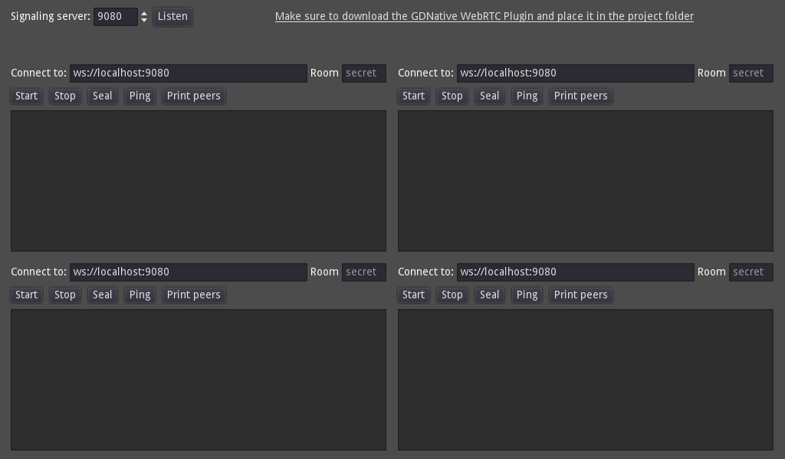

# WebSocket Signaling Server/Client for WebRTC

This demo is divided into four main parts:

1. **Server**: This folder contains the signaling server implementation written in GDScript. It's designed to be run by a game server running Godot.
2. **Server_Node**: This folder contains the signaling server implementation written in Node.js. Use this if you don't plan to run a game server but only match-making.
3. **Client**: This part contains the client implementation in GDScript, which is further divided into raw protocol and `WebRTCMultiplayer` handling.
4. **Demo**: This contains a small app that uses it.

The language used here is GDScript.

## Protocol

The protocol is JSON-based and uses messages in the following format:

```json
{
  "id": "number",
  "type": "number",
  "data": "string",
}
```

Here, `type` represents the message type, `id` represents a connected peer or `0`, and `data` holds the message-specific data.

The messages are as follows:

- `0 = JOIN`: Must be sent by the client immediately after connection to get a lobby assigned or join a known one (via the `data` field). This message is also sent by the server back to the client to notify the assigned lobby, or simply a successful join.
- `1 = ID`: Sent by the server to identify the client when it joins a room (the `id` field will contain the be assigned ID).
- `2 = PEER_CONNECT`: Sent by the server to notify new peers in the same lobby (the `id` field will contain the ID of the new peer).
- `3 = PEER_DISCONNECT`: Sent by the server to notify when a peer in the same lobby disconnects (the `id` field will contain the ID of the disconnected peer).
- `4 = OFFER`: Sent by the client when creating a WebRTC offer then relayed back by the server to the destination peer.
- `5 = ANSWER`: Sent by the client when creating a WebRTC answer then relayed back by the server to the destination peer.
- `6 = CANDIDATE`: Sent by the client when generating new WebRTC candidates then relayed back by the server to the destination peer.
- `7 = SEAL`: Sent by the client to seal the lobby (only the client that created it is allowed to seal a lobby), and then back by the server to notify success. When a lobby is sealed, no new client will be able to join, and the lobby will be destroyed (and clients disconnected) after 10 seconds.

For relayed messages (i.e., for `OFFER`, `ANSWER`, and `CANDIDATE`), the client will set the `id` field as the destination peer, then the server will replace it with the id of the sending peer, and send it to the proper destination.

## Screenshots



To run the Node.js server, use the following command:

```bash
cd server_node
node server.js
```